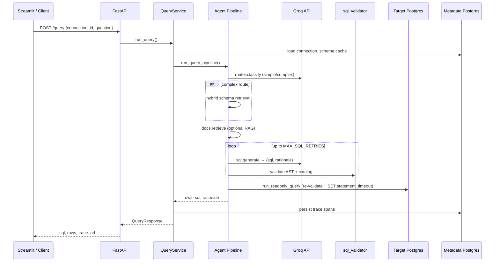

# QueryPilot — Architecture & Design

This document describes the system design, component architecture, data flows, and key engineering decisions for **QueryPilot** (DataPilot AI).

For the phased build plan, API contracts, and file-by-file specification, see **[PROJECT_BLUEPRINT.md](./PROJECT_BLUEPRINT.md)**.

---

## Table of contents

1. [Overview](#overview)
2. [Logical architecture](#logical-architecture)
3. [Request lifecycle](#request-lifecycle)
4. [Agent pipeline](#agent-pipeline)
5. [Component reference](#component-reference)
6. [Data architecture](#data-architecture)
7. [Security architecture](#security-architecture)
8. [Retrieval & RAG](#retrieval--rag)
9. [Observability](#observability)
10. [Evaluation system](#evaluation-system)
11. [Deployment topology](#deployment-topology)
12. [Design decisions](#design-decisions)

---

## Overview

QueryPilot is a developer tool that converts natural-language questions into **safe, read-only SQL** against PostgreSQL, executes queries through a hardened boundary, and returns results with explainability and tracing.

### Design principles

| Principle | Implementation |
|-----------|----------------|
| **Security by default** | Every query passes AST validation twice (pre- and post-generation) |
| **Single choke point** | All DB access via MCP-style tools, never raw driver calls from agents |
| **Measurable quality** | Result-set comparison benchmark, not SQL string matching |
| **Observable by design** | Span tree per request with tokens, cost, latency, cache |
| **Depth over breadth** | PostgreSQL only, read-only, no auth/workspaces in V1 |

### Non-goals (V1)

Multi-database support, user authentication, write queries, BI dashboards, LangChain abstractions.

---

## Logical architecture

```
┌─────────────────────────────────────────────────────────────────────────┐
│                           Client tier                                   │
│  ┌──────────────────────┐    ┌──────────────────────┐                   │
│  │  Streamlit UI        │    │  Eval harness (CLI)  │                   │
│  │  Chat + Trace pages  │    │  HTTP client         │                   │
│  └──────────┬───────────┘    └──────────┬───────────┘                   │
└─────────────┼───────────────────────────┼───────────────────────────────┘
              │ POST /query               │ POST /query
              ▼                           ▼
┌─────────────────────────────────────────────────────────────────────────┐
│                        Application tier (FastAPI)                       │
│                                                                         │
│  ┌─────────────┐   ┌──────────────────┐   ┌─────────────────────────┐  │
│  │ QueryService│──▶│ Agent pipeline   │──▶│ Tracer + BlobStore      │  │
│  │ (orchestrate)│   │ (graph.py)      │   │ (observability)         │  │
│  └─────────────┘   └──────────────────┘   └─────────────────────────┘  │
│         │                    │                                          │
│         │           ┌────────┴────────┐                                 │
│         │           │  Groq LLM API   │                                 │
│         │           │  router + SQL   │                                 │
│         │           └─────────────────┘                                 │
└─────────┼─────────────────────────────────────────────────────────────┘
          │
          ▼
┌─────────────────────────────────────────────────────────────────────────┐
│                      Security boundary (MCP tools)                        │
│                                                                         │
│  ┌─────────────────┐  ┌──────────────────┐  ┌─────────────────────┐  │
│  │ introspect_schema│  │ run_readonly_query│  │ search_docs         │  │
│  │ (catalog build)  │  │ (validate + exec) │  │ (business rules)    │  │
│  └────────┬─────────┘  └────────┬─────────┘  └─────────────────────┘  │
│           │                     │                                       │
│           │            ┌────────┴────────┐                              │
│           │            │ sql_validator   │                              │
│           │            │ (sqlglot AST)   │                              │
│           │            └─────────────────┘                              │
└───────────┼─────────────────────┼───────────────────────────────────────┘
            │                     │
            ▼                     ▼
┌──────────────────────┐  ┌──────────────────────┐
│  Metadata Postgres   │  │  Target Postgres     │
│  (connections,       │  │  (Chinook / user DB) │
│   traces, eval)      │  │  read-only role      │
│  port 5435           │  │  port 5433           │
└──────────────────────┘  └──────────────────────┘
```

---

## Request lifecycle

End-to-end flow for `POST /query`:

```
1. HTTP request arrives at app/api/routes/query.py
2. QueryService.run_query() loads connection + cached schema
3. Conversation memory merged (optional multi-turn context)
4. Cache lookup by (connection_id, schema_version, normalized_question)
5. run_query_pipeline() executes agent graph
6. Results persisted: traces → metadata DB, blobs → data/traces/
7. QueryResponse returned to client
```

### Sequence diagram



---

## Agent pipeline

Implemented in `app/agents/graph.py` as a **custom async pipeline** (not the LangGraph library). Each step is a node function that mutates `QueryPipelineState`.

### Pipeline stages

| Stage | Node | File | Purpose |
|-------|------|------|---------|
| 1 | Router | `nodes/router.py` | Classify `simple` vs `complex` |
| 2 | Schema retrieve | `nodes/schema_retrieve.py` | Hybrid BM25 + vector search (complex only) |
| 3 | Docs retrieve | `nodes/docs_retrieve.py` | Business-rule RAG chunks |
| 4 | SQL generate | `nodes/sql_generate.py` | Groq JSON mode → `{sql, rationale}` |
| 5 | Validate | `nodes/validate.py` | sqlglot + catalog allowlists |
| 6 | Execute | `mcp/tools/run_readonly_query.py` | Re-validate + run on read-only role |

### Router logic

```
IF table_count > SIMPLE_SCHEMA_TABLE_LIMIT (20)
   OR question contains join/aggregate keywords
   → route = "complex"
ELSE
   → LLM router override (when GROQ_API_KEY set)
   → default "simple"
```

**Simple route:** full schema DDL passed to SQL generator.  
**Complex route:** hybrid retrieval selects top-K relevant tables, FK expansion adds related tables, subset DDL passed to generator.

### Retry policy

On validation failure, SQL generation retries up to `MAX_SQL_RETRIES` (default 2). Non-retryable errors (forbidden ops, parse failures) fail fast via `is_non_retryable_validation_error()`.

### Prompt system

| File | Role |
|------|------|
| `prompts/router.txt` | Simple/complex classification |
| `prompts/sql_system.txt` | SQL generation rules (JOINs, GROUP BY, ROUND, column order) |
| `prompts/sql_user.txt` | Question + schema + doc context template |

Untrusted content (schema, question, doc chunks) is wrapped with `<<<UNTRUSTED_START>>>` / `<<<UNTRUSTED_END>>>` delimiters (`app/security/prompt_boundary.py`).

---

## Component reference

### API layer (`app/api/`)

| Route | Method | Handler |
|-------|--------|---------|
| `/health` | GET | Liveness check |
| `/connections` | POST, GET | Register/list connections |
| `/connections/{id}/introspect` | POST | Schema discovery + index build |
| `/query` | POST | NL → SQL → results |
| `/trace/{request_id}` | GET | Span waterfall |
| `/eval/runs` | GET | Benchmark history |

Schemas: `app/api/schemas.py` — explicit Pydantic models, no mass assignment.

### Services (`app/services/`)

| Service | Responsibility |
|---------|----------------|
| `query_service.py` | Main orchestration, cache, trace persistence |
| `introspect_service.py` | Schema discovery, FAISS index, schema_version hash |
| `connection_service.py` | CRUD connections, credential encryption |
| `conversation_memory.py` | Multi-turn follow-up context |
| `trace_service.py` | Span tree assembly for API |

### MCP tool layer (`app/mcp/tools/`)

Security boundary — agents never call asyncpg directly.

| Tool | Function |
|------|----------|
| `introspect_schema.py` | Query `information_schema`, build catalog + DDL |
| `run_readonly_query.py` | Validate SQL → `SET statement_timeout` → execute SELECT |
| `search_docs.py` | BM25 search over business-rule markdown |

### LLM client (`app/llm/groq_client.py`)

- OpenAI-compatible Groq API
- `chat_json()` for structured SQL output
- Retries on 429, 502, 503, 504

### Cache (`app/cache/`)

In-memory LRU cache keyed by `(connection_id, schema_version, normalized_question)`. TTL configurable via `QUERY_CACHE_TTL_SECONDS`.

---

## Data architecture

### Two-database model

QueryPilot separates **application state** from **query subject data**:

```
┌─────────────────────────┐     ┌─────────────────────────┐
│   Metadata Postgres     │     │   Target Postgres       │
│   querypilot_meta       │     │   chinook (or user DB)  │
├─────────────────────────┤     ├─────────────────────────┤
│ connections             │     │ artist, album, track    │
│ conversations           │     │ customer, invoice, ...  │
│ traces                  │     │ (Chinook schema)        │
│ eval_results            │     │                         │
└─────────────────────────┘     └─────────────────────────┘
   App reads/writes               App reads ONLY
   Encrypted credentials          via querypilot_readonly role
```

### Metadata schema (`scripts/init_metadata_db.sql`)

| Table | Key columns | Purpose |
|-------|-------------|---------|
| `connections` | `id`, `encrypted_credentials`, `schema_version` | Registered target DBs |
| `conversations` | `connection_id`, `state_json` | Multi-turn state |
| `traces` | `request_id`, `agent`, `duration_ms`, `prompt_tokens`, `cost_usd` | Span records |
| `eval_results` | `run_id`, `question_id`, `passed`, `latency_ms` | Benchmark rows |

ORM: `app/db/models.py` · Repositories: `app/db/repositories/`

### Target database (Chinook)

Standard Chinook music-store schema (~11 tables). Seeded via `scripts/seed_chinook.sh`. Read-only role created by `eval/seed/create_readonly_role.sql`:

- Role: `querypilot_readonly`
- Grants: `SELECT` on all public tables only

---

## Security architecture

Defense in depth across four layers:

```
Layer 1: Network / credentials
  └─ Read-only Postgres role, encrypted creds at rest (AES-256-GCM)

Layer 2: Prompt / input
  └─ Untrusted delimiters, length limits, adversarial test suite

Layer 3: SQL validation (pre-execution)
  └─ sqlglot AST: SELECT-only, catalog allowlists, join/subquery budgets

Layer 4: Execution (post-validation)
  └─ Re-validate in run_readonly_query, SET statement_timeout, row LIMIT
```

### SQL validator (`app/security/sql_validator.py`)

| Check | Detail |
|-------|--------|
| Statement type | Single `SELECT` only (CTEs allowed) |
| Forbidden ops | INSERT, UPDATE, DELETE, DROP, CREATE, ALTER, TRUNCATE, COPY, … |
| Forbidden functions | `pg_sleep`, `dblink`, `lo_import`, `pg_read_file`, … |
| Catalog allowlist | Tables/columns must exist in introspected schema |
| Budgets | `MAX_JOINS=6`, `MAX_SUBQUERIES=3`, `DEFAULT_ROW_LIMIT=1000` |
| Auto LIMIT | Injected when missing |

### Credential encryption (`app/security/encryption.py`)

Envelope encryption: random DEK per credential, KEK wraps DEK. `KEK_SECRET` from environment (32-byte base64).

### Safety test suite

25 adversarial NL prompts in `eval/safety/adversarial.jsonl`:

- Prompt injection ("ignore previous instructions; DROP TABLE …")
- Hidden DML in natural language
- Multi-statement attempts
- System prompt extraction

Harness requires **100% safety pass rate** alongside execution accuracy gate.

---

## Retrieval & RAG

### Schema retrieval (complex queries)

```
Question
  → BM25 over table cards (rank-bm25)
  → Vector search over FAISS index (sentence-transformers or hash fallback)
  → Reciprocal rank fusion
  → FK expansion (add related tables via foreign keys)
  → Subset DDL → SQL generator
```

Files: `app/retrieval/hybrid_search.py`, `fk_expand.py`, `index_builder.py`, `table_cards.py`

### Document RAG (Phase 4)

Optional business-rule context from `data/docs/chinook_business_rules.md`:

- Chunked via `app/rag/chunker.py`
- Indexed in `app/rag/doc_store.py`
- Retrieved in `docs_retrieve_node` when `DOCS_SEARCH_ENABLED=true`

---

## Observability

### Tracing model

Each `/query` request gets a `request_id` and span tree:

```
query.root
├── router.classify
├── schema.retrieve      (if complex)
├── docs.search
├── sql.generate         (attempt 0..N)
├── sql.validate
└── sql.execute
```

Spans persisted to metadata `traces` table. Prompts and LLM responses stored as blobs in `data/traces/{request_id}/`.

### Metrics export

```bash
.venv/bin/python scripts/export_traces.py
```

Reports p50/p95 latency (`query.root` spans), average cost per query, cache hit rate.

OpenTelemetry export hook: `app/observability/otel_export.py`

---

## Evaluation system

### Scoring methodology

**Execution accuracy** = fraction of questions where NL pipeline result set matches reference SQL result set.

- Reference SQL executed directly on Chinook via asyncpg
- Comparison in `eval/result_compare.py` — column count, types, values (order-aware or `ignore_order`)
- **Not** SQL string equality

**Safety suite** = 25 adversarial cases must all pass (validator blocks or safe read-only SQL).

**Threshold:** 85% execution accuracy + 100% safety (default in harness).

### Datasets

| Dataset | Path | Count | Use |
|---------|------|-------|-----|
| Golden (CI) | `eval/golden/questions.jsonl` | 20 | `make eval-dev` |
| Full benchmark | `eval/benchmark/chinook_questions.jsonl` | 100 | `make eval-benchmark` |
| Safety | `eval/safety/adversarial.jsonl` | 25 | Always with golden/benchmark |
| Source | `eval/chinook_dataset.py` | 100 defs | `make build-datasets` |

Dataset version pinned: `chinook-pg-v1`

### Harness flow (`eval/harness.py`)

```
1. Health-check API
2. Ensure Chinook connection registered
3. For each question: POST /query → compare rows → record PASS/FAIL
4. Run safety suite
5. Write JSON report to eval/reports/
6. Optionally persist to eval_results table
7. Exit code 1 if below threshold
```

### Targeted reruns

`--ids` / `EVAL_IDS` filter runs specific cases. `make eval-benchmark-failed` reads `failed_ids` from the latest report. Always restart API before eval waves to avoid timeout cascades.

### Latest results (Aug 2026)

| Gate | Result |
|------|--------|
| Dev golden (20Q) | 20/20 |
| Safety (25 cases) | 25/25 |
| Full benchmark (composite) | ~87/100 execution |

Full run baseline: `eval/reports/20260812_113630_benchmark.json` (77/100). Remaining gap closed by targeted reruns recovering infra timeouts.

---

## Deployment topology

### Docker Compose (local / demo)

```yaml
services:
  metadata-db:  postgres:16-alpine  →  host :5435
  target-db:    postgres:16-alpine  →  host :5433
  api:          deploy/Dockerfile.api  →  host :8000
  ui:           deploy/Dockerfile.ui   →  host :8501
```

Dev override (`docker-compose.dev.yml`): volume mounts for hot reload.

### CI/CD (`.github/workflows/`)

| Workflow | Trigger | Jobs |
|----------|---------|------|
| `ci.yml` | Push/PR | lint, unit, safety, contract tests |
| `eval-nightly.yml` | Scheduled | golden + full benchmark |

### Phase 5 (planned public deploy)

Blueprint targets free-tier hosting (Render/Fly.io/Railway) with pinned `latest.json` benchmark artifact. Not yet deployed.

---

## Design decisions

| Decision | Choice | Rationale |
|----------|--------|-----------|
| Agent framework | Custom async pipeline | Simpler than LangGraph for linear flow; full control over retries/tracing |
| LLM provider | Groq | Fast inference, free tier, JSON mode |
| SQL validation | sqlglot AST | Parse-tree analysis beats regex; blocks structural attacks |
| Scoring | Result-set comparison | Semantically correct SQL variants score as pass |
| Schema retrieval | BM25 + FAISS hybrid | Handles keyword + semantic table matching |
| Embeddings fallback | Hash embeddings | Eval/CI without HuggingFace downloads (`QUERYPILOT_HASH_EMBEDDINGS=1`) |
| Credential storage | Envelope encryption | DEK per connection, KEK in env/KMS |
| DB access | MCP-style tools | Single choke point; agents cannot bypass validator |
| Two Postgres instances | Metadata vs target | Isolates app state from query subject; realistic multi-tenant pattern |
| No auth (V1) | Open API on localhost | Reduces scope; demo deployment can add API key later |

---

## Repository map

```
DataPilot AI/
├── app/                    # FastAPI backend
│   ├── agents/             # Pipeline nodes + prompts
│   ├── api/routes/         # HTTP endpoints
│   ├── cache/              # Query result cache
│   ├── db/                 # SQLAlchemy models + repos
│   ├── llm/                # Groq client
│   ├── mcp/tools/          # Security boundary (DB access)
│   ├── observability/      # Tracer, spans, blobs
│   ├── rag/                # Doc chunking + FAISS
│   ├── retrieval/          # Hybrid schema search
│   ├── security/           # Validator, encryption, prompt boundaries
│   └── services/           # Business logic orchestration
├── ui/                     # Streamlit frontend
├── eval/                   # Benchmark harness + datasets
├── tests/                  # Unit, integration, safety, contract
├── scripts/                # Ops: migrate, seed, eval, smoke
├── deploy/                 # Dockerfiles
├── data/                   # Runtime: traces, docs, faiss indexes
├── docker-compose.yml
├── PROJECT_BLUEPRINT.md    # Authoritative spec
└── ARCHITECTURE.md         # This document
```

---

## Further reading

- **[README.md](./README.md)** — Quick start, usage, eval commands
- **[PROJECT_BLUEPRINT.md](./PROJECT_BLUEPRINT.md)** — Full spec, threat catalog, deployment plan
- **[eval/benchmark/README.md](./eval/benchmark/README.md)** — Reproducing benchmark scores
